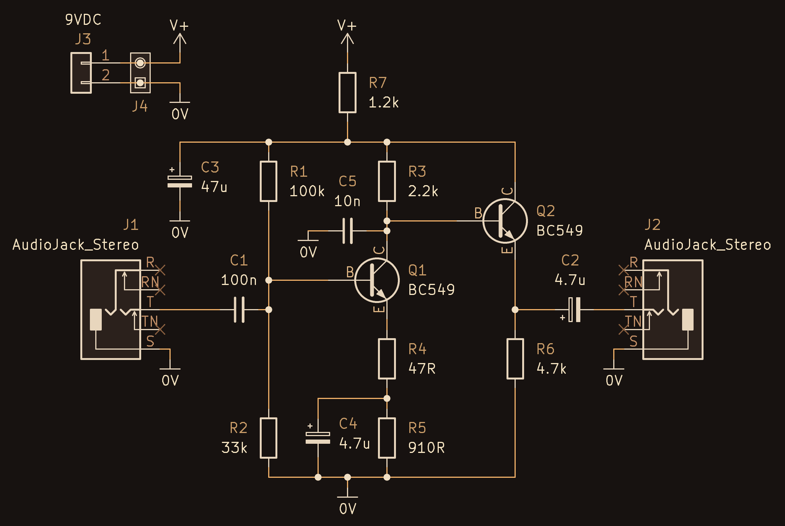
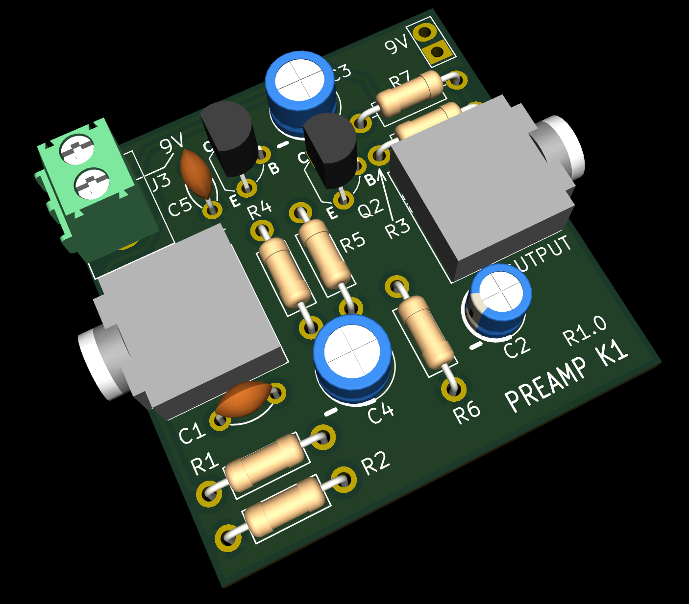
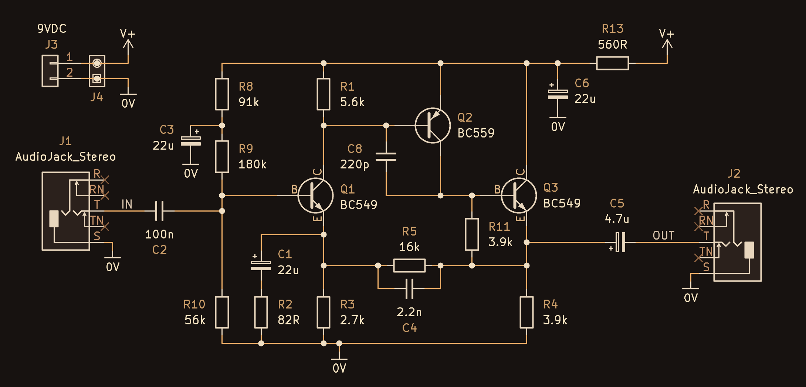
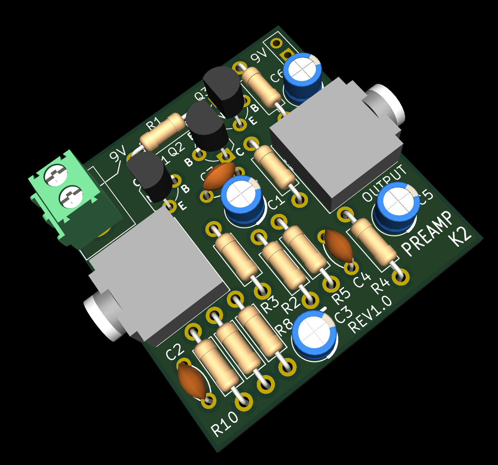

# Discrete Amps

This repository contains  discrete audio amplifier designs intended primarily for HF receiver applications (speech bandwidth, not music).  

Each design includes:
- KiCad 10 Schematic and PCB files
- KiCad 10 SPICE Simulation Workbook
- Gerber files for fabrication  
- PDF schematic export and PCB screenshots for easy viewing without KiCad  

---

## Preamp K1

Designed by M. Kellett, this preamplifier is optimised for speech signals in HF receivers.

- **Gain:** ~28 dB  
- **Bandwidth (-3 dB):** ~150 Hz to 10 kHz (approximate)  
- **Use case:** Moderate gain front-end with relatively wide speech bandwidth  

### Schematic

### PCB Top

### PCB Underside

### PCB Render

---

## Preamp K2

Also designed by M. Kellett, this version provides higher gain and a slightly narrower bandwidth, making it suitable where additional amplification is required.

- **Gain:** ~45 dB  
- **Bandwidth (-3 dB):** ~100 Hz to 7 kHz (approximate)  
- **Use case:** Higher gain stage for weak signal amplification  

### Schematic

### PCB Top

### PCB Underside

### PCB Render

---

## Notes

These designs are intended for experimentation and adaptation.

All components are easy to source. For the 9V power connection, the PCB will accomodate any 2-pin screw terminal block with 3.5 to 5.08 mm pin pitch. For the audio input and output, an AliExpress stereo audio jack socket can be used (only the tip and the screen is used, the ring is not connected). Alternatively, the audio connections can be made with 0.1" pin headers (they will fit in the same footprint, as there are extra holes for that).

